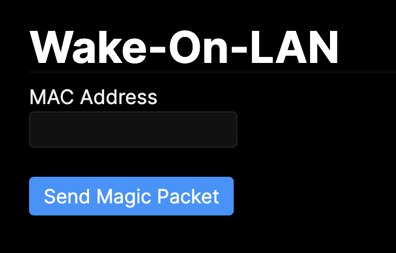

# Wake-On-LAN Server

> [!CAUTION]
> The Rust version is currently in beta.


Previously, this ran on Python + Nginx, but it has been rewritten as a single-file executable in Rust.
The old version is in [legacy](./legacy) but will not be maintained.


## What is this?

This is a server for sending Magic Packets from a web browser to wake up PCs.
It is intended to run constantly on a Raspberry Pi or similar device.
It is convenient to install [cloudflared](https://github.com/cloudflare/cloudflared) or [Tailscale](https://tailscale.com/) on the Raspberry Pi for easy access.




## Configuration

There is no configuration file. It starts on port 3000.

### Installation

It is recommended to place the binary in `/usr/local/bin`.
You can download the latest release from GitHub.

```bash
# For Raspberry Pi 3/4/5 (64bit)
curl -L -o wakeonlan-server.tar.gz https://github.com/macoshita/wakeonlan-server/releases/latest/download/wakeonlan-server-linux-arm64.tar.gz
tar -xzf wakeonlan-server.tar.gz
sudo mv wakeonlan-server /usr/local/bin/
rm wakeonlan-server.tar.gz

# For Intel/AMD 64bit
curl -L -o wakeonlan-server.tar.gz https://github.com/macoshita/wakeonlan-server/releases/latest/download/wakeonlan-server-linux-amd64.tar.gz
tar -xzf wakeonlan-server.tar.gz
sudo mv wakeonlan-server /usr/local/bin/
rm wakeonlan-server.tar.gz
```

### Usage

```bash
# Start the server (default port 3000)
wakeonlan-server

# Start on a specific port
wakeonlan-server --port 8080
```

Access http://localhost:3000/wol to view the operation screen.

> [!NOTE]
> The author runs this on port 3000 as is, and accesses it via [cloudflared](https://github.com/cloudflare/cloudflared) tunnel.

### Automatic Startup (systemd)

This binary has a feature to automatically generate and place systemd configuration files.

```bash
# Register to systemd and start (default port 3000)
sudo wakeonlan-server service install

# Register with a specific port
sudo wakeonlan-server --port 8080 service install

# Remove from systemd
sudo wakeonlan-server service uninstall
```

## Build Instructions

A Rust environment is required.

```bash
cargo build --release
```

### Cross-compilation

If you are cross-compiling for Raspberry Pi, etc., using [cargo-zigbuild](https://github.com/rust-cross/cargo-zigbuild) is recommended.

```bash
# Install
cargo install cargo-zigbuild

# For Raspberry Pi 3/4 (64bit)
cargo zigbuild --target aarch64-unknown-linux-gnu --release
```

